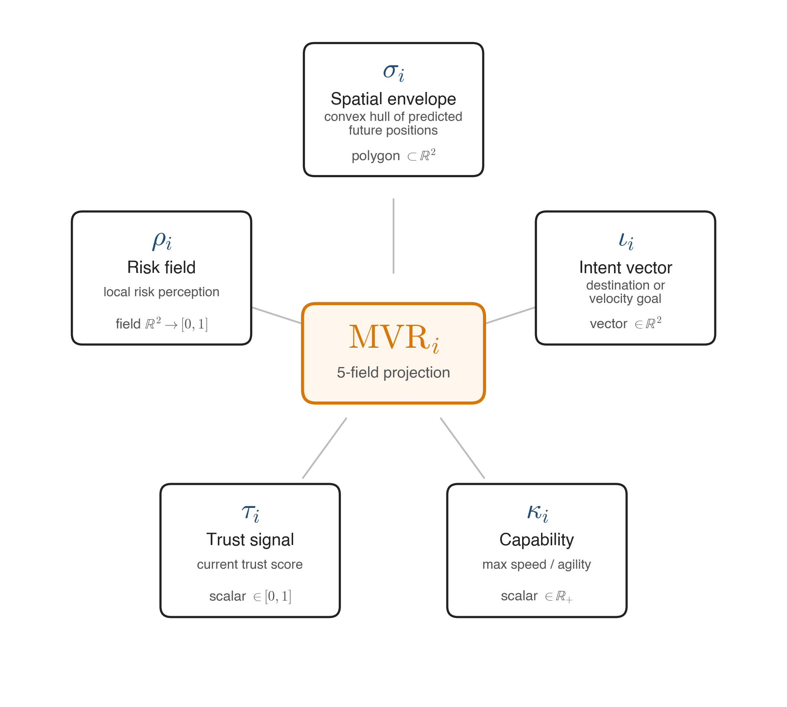
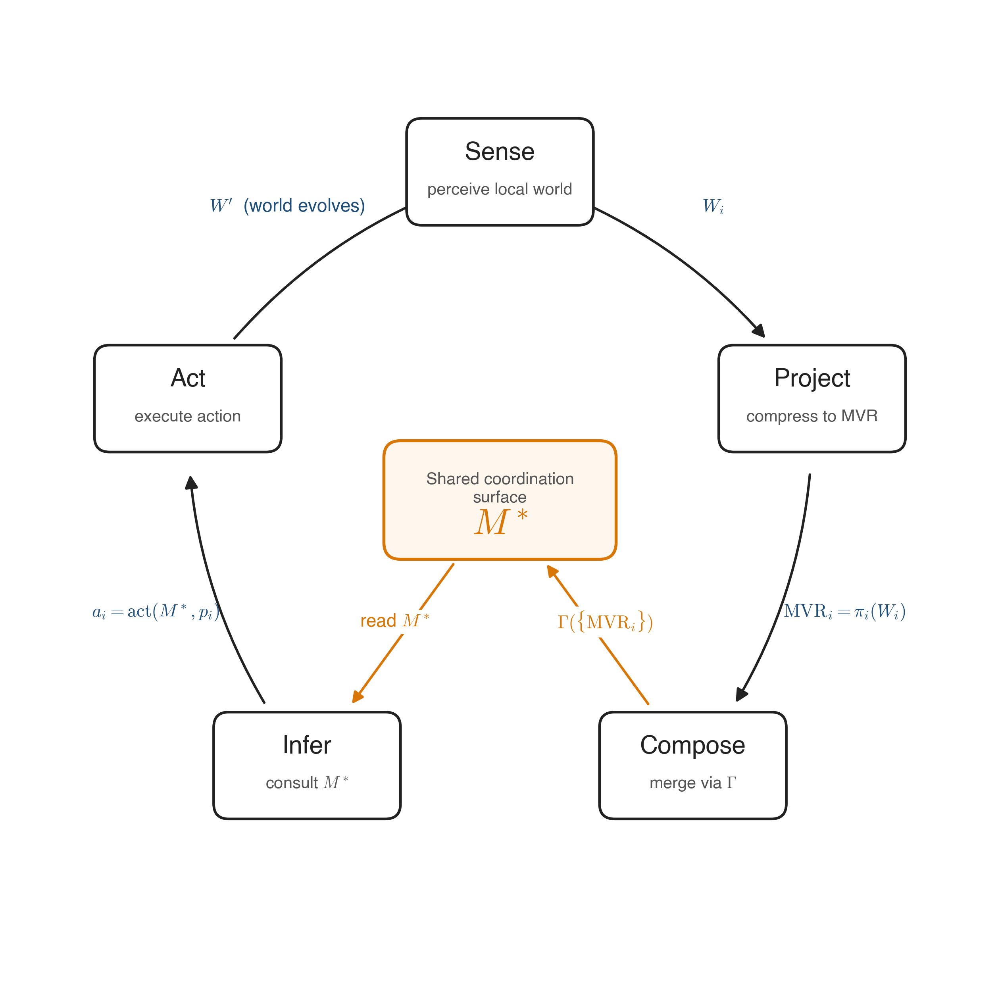
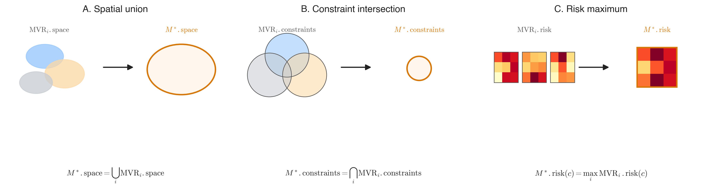
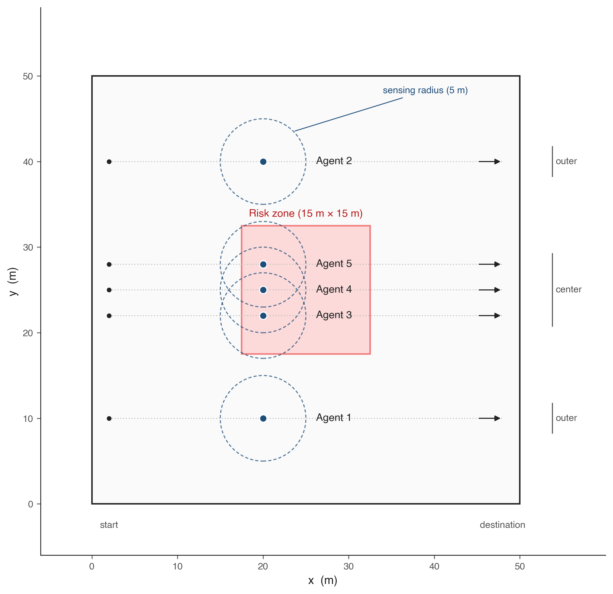
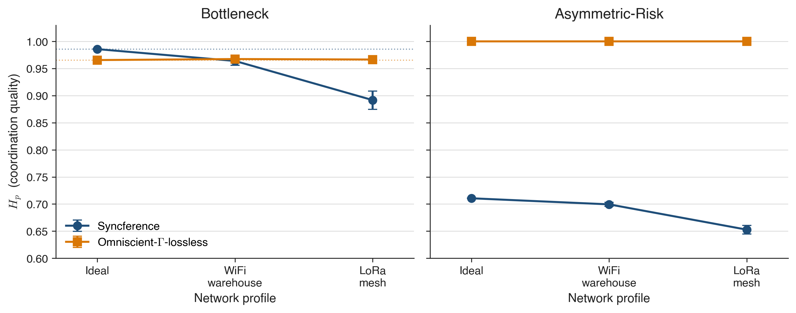

# The Wisdom of Physics
## Sovereign Coordination as a Physical Substrate for Multi-Agent Autonomy

**Gustavo Emmanuel Briones Jara**
ROCH3 · Tepic, Nayarit, México · gustavo@roch3.ai

**Date:** April 2026
**Venue:** Zenodo (DOI pending)
**Data:** MAZ3 v1.1.0 — github.com/roch3-ai/MAZ3
**Pre-registration:** OSF · https://osf.io/kjcwg · DOI: 10.17605/OSF.IO/KJCWG

---

## Author's Note on This Revision

Earlier versions of this paper (v1–v3) claimed that sovereign coordination with lossy MVR projections empirically matched a centralized omniscient coordinator — a result we called *Sovereign Behavioral Equivalence*. An adversarial review process across five independent LLM reviewers over two rounds flagged the Omniscient baseline as structurally suboptimal (heuristic composition rather than the same Γ operator used by Syncference), making the comparison non-informative. We re-implemented the baseline so the only difference between the two systems is MVR fidelity (lossless vs. lossy), holding Γ constant, and constructed a second scenario (Asymmetric-Risk) specifically designed to test whether richer M* translates into behavioral improvement under the agent policies used. The reformulated result in §5.2 is weaker and more interesting than the prior claim: the cost of sovereignty **under local myopic agent policies** is epistemic (a less coherent M*) not behavioral (identical task outcomes) — with the important caveat that policies with bounded look-ahead may break this equivalence, which is the explicit empirical target of planned follow-up work (§7.2).

The four hypotheses evaluated here (H1–H4 in §5.2) were pre-registered at OSF (DOI: 10.17605/OSF.IO/KJCWG) prior to the N=500 confirmatory replication run. The registration declares Foreknowledge Level 6 (preliminary N=50 data observed by the author before hypotheses were registered); this is a pre-registration of confirmatory replication, not of an initial hypothesis-generating study, with the epistemic weight that accompanies that distinction (cf. Lakens 2019). H4 is a directional *negative* prediction — that the H_p advantage of lossless composition does not propagate to task metrics under the tested policy class — which is epistemically costly for an author motivated to demonstrate protocol superiority. **All four pre-registered hypotheses were confirmed exactly by the N=500 data reported in §5**: H1 (zero collisions for Syncference), H2 (Bottleneck task ≤ 0.10), H3 (|Δ H_p| > 0.10 in Asymmetric-Risk; observed 0.29–0.35), H4 (task-level non-propagation under local policies). Two observations not pre-registered are reported as explicitly exploratory in §5.2–5.3: ORCA's collision failure mode under saturated corridor geometry (invisible at N=50), and network-modulated SBE crossover in Bottleneck.

---

## Abstract

Heterogeneous autonomous agents from different manufacturers cannot coordinate in shared physical spaces without either a central authority (which violates sovereignty) or full state sharing (which violates proprietary IP). Existing approaches—VDA 5050, ROS 2/Nav2, ORCA, and Dec-POMDPs—require homogeneity, centralization, or are computationally intractable for real-time physical coordination.

We introduce **Syncference**, a five-phase coordination protocol where each agent projects a lossy five-field summary—the *Minimum Viable Reality* (MVR)—into a shared buffer. A conservative composition operator Γ (union of spatial claims, intersection of constraints, maximum of risk per cell) produces a collision-free coordination plan in sub-millisecond latency. Trust assumptions are minimal: agents do not reveal proprietary state, do not share a global objective, and do not reach consensus; a trust-degrading detection layer handles actively-adversarial participants.

We validate Syncference empirically across two scenarios with N=500 runs per cell via **MAZ3**, a public Apache 2.0 benchmark. Comparisons include ORCA (van den Berg et al. 2011) as a standard baseline and an OmniscientCoordinator that feeds lossless MVRs into the same composition operator Γ — isolating the cost of sovereignty as the single axis of comparison. All empirical hypotheses were pre-registered at OSF (DOI: 10.17605/OSF.IO/KJCWG) prior to the N=500 confirmatory run; all four pre-registered hypotheses were confirmed. **Scope note (critical):** all task-level equivalence claims in this paper are conditional on the local myopic policy class tested (agents consult only the current-cell value of M*); whether the observed H_p advantages of lossless composition translate to task-level differences under policies with bounded look-ahead is the explicit empirical target of planned follow-up work (§7.2). Three headline findings: (a) Syncference achieves zero collisions across all 7,500 Syncference runs; (b) under asymmetric-information conditions with local myopic policies, Γ with lossless inputs produces a composite M* with strictly higher coordination coherence than Γ with lossy inputs (H_p 1.000 vs 0.65–0.71, |Δ| = 0.29–0.35), but the difference does not propagate to task-level outcomes — a pre-registered directional negative prediction (H4) confirmed exactly; (c) an unexpected N=500 finding: ORCA under saturated corridor geometry exhibits 0.22–0.27 collisions per cycle with task completion ≤ 0.05, a failure mode invisible at N=50 but emergent with larger samples. Additional exploratory findings on network-modulated composition advantage and adversarial detection are reported in §5.

Syncference proposes a third paradigm for multi-entity coordination — distinct from both centralization and consensus — where conservative composition of partial, lossy projections produces a shared coordination surface without requiring objective sharing, full state disclosure, or global agreement. We release MAZ3 as a public benchmark and do not claim it is the only such benchmark; we claim it is a benchmark designed around sovereignty, adversariality, and documented failure modes.

---

## 1. Introduction

### 1.1 The Coordination Gap

Consider a warehouse intersection where a Waymo robotaxi, an Amazon delivery drone, and a KUKA industrial arm must share physical space. Each runs proprietary AI that its manufacturer will never expose. How do they coordinate without colliding?

This is not a hypothetical scenario. Commercial robotaxi services are operating at six-figure weekly ride volumes, and autonomous delivery robots, drones, and industrial AGVs from multiple vendors increasingly share physical space with them. Industry leaders have publicly acknowledged that the frontier challenge is no longer highway driving but subtle low-speed negotiations — drop-offs, intersections, pedestrian interactions — precisely the scenarios where heterogeneous agents must coordinate without sharing proprietary perception models.

Current solutions fall into three categories, each with a fundamental limitation:

**Centralization** (VDA 5050, fleet management systems): A master server collects all agent states and issues commands. This requires every agent to subordinate its decision-making to a single authority—a condition no manufacturer will accept for competitive and liability reasons. It creates a single point of failure and violates the sovereignty of the agent's proprietary algorithms.

**Consensus** (Paxos, Raft, BFT protocols, Dec-POMDPs): All agents share complete state and negotiate agreement on a global truth. Dec-POMDPs are NEXP-complete (Bernstein et al. 2002), making them computationally intractable for real-time sub-millisecond decisions. Blockchain-based approaches cannot meet the <8 ms physical reaction windows required for industrial safety.

**Homogeneous protocols** (ROS 2/Nav2, ORCA): All agents must run the same collision avoidance algorithm. This works for single-vendor fleets but fails for heterogeneous ecosystems where each manufacturer has invested billions in proprietary AI that they will never standardize.

The gap is clear: no existing system achieves real-time physical coordination among heterogeneous, mutually opaque, mutually distrustful autonomous agents.

### 1.2 Framing Intuition

A helpful intuition for sovereign coordination comes from rubble-pile bodies: a gravitationally-bound aggregate of fragments that coheres without any fragment knowing the shape of any other, and without a central authority assigning positions. The aggregate holds together because conservative physical forces make divergence more expensive than convergence. This is an intuition, not a formal correspondence — Syncference is not an implementation of orbital mechanics — but it captures the relevant design principle: coordination through conservative composition of lossy contributions, not through trust, consensus, or central dispatch.

### 1.3 Intellectual Genealogy

The problem of "order without central authority" has been addressed across disciplines for over a century. We identify five predecessors whose formal contributions map directly onto components of Syncference. A broader genealogy—spanning Roman *Ius Gentium*, Darwin, Durkheim, Simmel, Goffman, Granovetter, and surveying practice—is catalogued in Appendix B as supplementary context.

**Roche (1849).** Édouard Roche defined the Roche Lobe: the region in a binary system where one body's gravitational influence dominates. We formalize the agent's Spatial Envelope as a *dynamic Roche Lobe* — the region where an agent's operational influence dominates over its neighbors. The envelope contracts as neighbors approach and expands as they recede. This is a structural analogy: the governing equations differ, but the geometry of dominance regions under competing influences is shared.

**Morgan (1923).** Garrett Morgan's three-position traffic signal was, in retrospect, the first Minimum Viable Reality: a lossy ternary projection (stop/go/caution) that coordinated drivers without requiring any of them to reveal destination, speed, or vehicle type. Syncference generalizes this principle: coordination requires only a shared constraint surface, not shared state.

**Cerf & Kahn (1974).** TCP/IP enabled heterogeneous networks to interoperate without standardizing their internal architectures. A packet traverses routers that know nothing about each other's implementation. Syncference applies the same architectural principle to physical coordination: agents interoperate through a fixed-schema projection (the MVR) without standardizing their internal inference.

**Luhmann (1984).** Niklas Luhmann described autopoietic social systems as *operationally closed but structurally coupled*: each system reproduces itself through its own operations while interacting with its environment through a limited interface. Each Syncference agent is operationally closed (proprietary inference, opaque to all others) and structurally coupled through the MVR buffer. The buffer is the coupling mechanism; agent internals remain closed.

**Friston (2010).** The Free Energy Principle posits that organisms minimize surprise by maintaining internal models that predict sensory input. We define a coordination free energy F_sync that agents minimize by projecting MVR fields that reduce divergence between their local model and the shared state. Concretely:

> F_sync(i, t) = D_KL[ q_i(s | MVR_i) ‖ p_i(s | M*) ] + 𝔼_q_i[ ‖π_i(W_i) − M*|_i‖ ]

where q_i(s | MVR_i) is agent i's local belief about the joint coordination state s conditioned on its own projection MVR_i, p_i(s | M*) is its belief after observing the composite M* produced by Γ, and the second term penalizes deviation between the agent's projection and its own contribution to M* — i.e. the error the agent accepts by submitting a lossy summary. The agent minimizes F_sync across cycles by adjusting which fields it projects and how coarsely. **Methodological note:** F_sync is a theoretical formulation that guides protocol design (motivating the 5-field MVR schema as the sufficient statistic and Γ as the composition operator that minimizes composite surprise); the distributions q_i and p_i are not empirically estimated in the MAZ3 experiments reported in this paper. The isomorphism with Friston's variational free energy is at the level of the functional form (KL divergence + projection-fidelity penalty) and the optimization target, not at the level of direct numerical correspondence between F_sync values and measured H_p values. A follow-up paper will estimate F_sync empirically via explicit distributional modeling of agent beliefs; here, F_sync serves as the theoretical motivation for the protocol, not as an experimental outcome.

This is a formal isomorphism with Friston's variational free energy at the level of the optimization target: both minimize a KL divergence between a local generative model and an observed distribution, with a sufficient statistic (the MVR here, the Markov blanket in Friston's formulation) mediating the interface. The interpretations differ — active inference in organisms vs. coordination in sovereign agents — and the prior and likelihood structures are domain-specific, but the variational machinery and the functional form are shared.

Together, these five contributions provide the formal scaffolding for Syncference: envelope geometry (Roche), projection-based coordination (Morgan), layered interoperability (Cerf & Kahn), operational closure with structural coupling (Luhmann), and variational minimization of coordination surprise (Friston).

### 1.4 Contributions

This paper makes five contributions:

1. **Syncference protocol.** We specify a five-phase coordination loop with stated formal properties — bounded algorithmic convergence, monotonic safety, graceful degradation — supported empirically and sketched as motivating arguments in §3.4, with full proofs deferred to companion work.
2. **Conservative composition operator Γ and its empirical characterization.** Under N=500 runs across two scenarios (Bottleneck, Asymmetric-Risk) × three network profiles, pre-registered at OSF prior to the confirmatory run, we show that Γ with lossy per-agent inputs and Γ with lossless inputs (holding the operator constant) produce identical task-level outcomes under the local agent policies tested — while producing measurably different shared surfaces M* as measured by the coordination-coherence index H_p. We identify the mechanism: local policies discard the richness of M* beyond the agent's current cell. This reformulates a stronger claim made in prior drafts (that sovereign coordination strictly matches omniscient control) into a more honest and more informative result: the cost of sovereignty under local policies is epistemic, not behavioral (§5.2).
3. **MAZ3 benchmark.** We release a public benchmark for sovereign multi-agent coordination, with a reproducible harness that includes ORCA (van den Berg et al. 2011) as a standard external baseline, and a reimplemented OmniscientCoordinator that isolates the cost of sovereignty as the single axis of comparison. Apache 2.0. All numbers in this paper are reproducible from the repository via a single command (§8.1).
4. **Empirical validation.** We document sub-millisecond algorithmic convergence (excluding network latency δ, on reference hardware in §4.1), one-cycle adversarial detection, graceful degradation under network impairment, and a separate finding — lossless composition absorbs network noise while lossy composition degrades monotonically — that quantifies a bounded robustness advantage of centralized state distinct from the SBE axis.
5. **A third coordination paradigm.** We propose sovereign coordination as formally distinct from centralization and consensus, differentiated specifically against DCOP (§2.2), V2X, RSS, and ORCA, with explicit trade-offs. We document the failure modes of the paradigm — symmetric deadlock, the insensitivity of local policies to richer M* — with the same emphasis as its successes.

### 1.5 Paper Organization

Section 2 reviews related work. Section 3 formalizes the Syncference protocol. Section 4 describes the MAZ3 benchmark. Section 5 presents empirical results. Section 6 discusses the physics of coordination, failure modes, and extensions. Section 7 concludes.

---

## 2. Related Work

### 2.1 Centralized Coordination

VDA 5050 is the German B2B standard for AGV fleet management. It requires a master controller that issues commands to all agents. Single-vendor fleet management systems (6 River Systems, Locus Robotics) operate similarly. These systems violate sovereignty by design: agents do not decide—they obey.

### 2.2 Consensus-Based Systems

Classical distributed consensus (Paxos, Raft) requires agreement on global state. BFT protocols (PBFT) tolerate Byzantine faults but require O(n²) messages. Dec-POMDPs provide the formal framework for decentralized decision-making under partial observability, but are NEXP-complete and computationally intractable for real-time physical coordination.

Distributed Constraint Optimization (DCOP) is the canonical framework for decentralized coordination under local constraints: agents hold private variables and constraints, communicate bounded messages, and converge to a joint assignment without central authority (Petcu & Faltings 2005; Rogers, Farinelli, Stranders & Jennings 2011). Classical DCOP algorithms — DPOP, Max-sum, DSA — share with Syncference the goal of coordination without a master node. The key distinctions are:

1. **Objective sharing.** DCOP agents reveal their cost functions (or sampled values thereof) to enable joint optimization. Syncference agents never reveal their objectives; only the five MVR fields cross the channel. Sovereignty in DCOP is over the assignment, not over the function.
2. **Convergence time.** DCOP convergence is bounded in communication rounds, often linear in the induced width of the constraint graph. Syncference commits to one communication round per cycle and a fixed algorithmic composition bound — sufficient for real-time physical actuation at ≤10 Hz, which most DCOP formulations cannot guarantee.
3. **Composition operator.** DCOP aggregates via sum, max, or message-passing tree propagation over agent-local costs. Γ aggregates via union (space), intersection (constraints), and pointwise max (risk), producing a conservative shared surface rather than a globally-optimal joint assignment.

Syncference is therefore not a DCOP algorithm; it is a distinct coordination mechanism that sacrifices joint optimality for sub-millisecond conservative safety composition while preserving stronger sovereignty than DCOP provides.

### 2.3 Collision Avoidance

ORCA (van den Berg et al. 2011) computes reciprocal velocity obstacles for collision-free navigation. It assumes all agents run the same algorithm — a requirement incompatible with heterogeneous fleets. ACAS-X is a centralized advisory system for aircraft that requires transponder data sharing. Control Barrier Functions (Ames et al. 2017) provide formal safety guarantees but require centralized knowledge of system dynamics.

Responsibility-Sensitive Safety (Shalev-Shwartz, Shammah & Shashua 2017) formalizes a set of driving rules with provable safety guarantees under worst-case assumptions about other drivers. RSS is, in our terms, a constraint set C shared by convention; it does not provide a mechanism for agents to project dynamic spatial, temporal, or risk information to one another. Syncference is complementary: agents can ship with RSS-derived constraints embedded in their C_i field, and Γ will compose them without modification.

Vehicle-to-everything (V2X) standards — SAE J2735 BSM, ETSI CAM/DENM, and 3GPP C-V2X — define broadcast messages for cooperative awareness. These standards specify *what fields* vehicles broadcast (position, heading, speed, event notifications), but they do not define a composition operator over received messages or formal properties of the resulting shared state. Each receiver applies its own proprietary logic to incoming messages. Syncference differs at exactly this point: it defines Γ as a fixed composition operator with formal safety and convergence properties, producing a shared coordination surface rather than a stream of independently-interpreted broadcasts.

### 2.4 Multi-Agent Benchmarks

PettingZoo provides multi-agent RL environments but has no sovereignty concept. SMAC evaluates cooperative StarCraft play with full state sharing. CARLA simulates autonomous driving with a focus on individual perception, not multi-agent coordination.

None of these benchmarks measure coordination quality under sovereignty constraints, adversarial agents, and information asymmetry. MAZ3 fills this gap.

**Comparison Table:**

| System | Central? | Consensus? | Sovereign? | Real-time? | Heterog.? |
|---|---|---|---|---|---|
| VDA 5050 | Yes | — | No | Yes | No |
| Paxos/Raft | No | Yes | No | No | Yes |
| Dec-POMDP | No | No | Partial | No (NEXP) | Yes |
| DCOP (DPOP, Max-sum) | No | No | Partial | Limited | Yes |
| ORCA | No | No | No | Yes | No |
| ACAS-X | Yes | — | No | Yes | No |
| RSS | No | No | Partial | Yes | Yes |
| V2X (J2735/CAM) | No | No | Partial | Yes | Yes |
| **Syncference** | **No** | **No** | **Yes** | **Yes** | **Yes** |

RSS, V2X, and DCOP achieve *partial* sovereignty: none requires a central authority or consensus, but none defines a fixed formal composition operator over the received state with both real-time and objective-privacy properties. DCOP relaxes objective privacy; RSS and V2X relax composition formality. Syncference closes this gap.

---

## 3. Syncference Protocol

### 3.1 System Model

We consider n heterogeneous agents {a₁, …, aₙ} in a shared space W ⊂ ℝ². Each agent has proprietary perception and inference opaque to all others. Communication is via broadcast with bounded latency δ. The protocol assumes no central authority, no shared algorithm, and no global objective; trust assumptions are minimal and handled by a detection layer (§3.6) that degrades trust for agents whose projections diverge from observable physical behavior.

### 3.2 Minimum Viable Reality (MVR)

**Definition (MVR Projection)** (Figure 4). Each agent a_i projects a lossy five-field summary of its local model W_i:

> π_i(W_i) = {B_i, τ_i, I_i, C_i, R_i}

- **B_i(t) ⊂ W**: Spatial Envelope — the dynamic Roche Lobe where the agent's operational influence dominates.
- **τ_i(t) = (timestamp, drift_bound)**: Temporal Sync — local clock and maximum drift, corrected by a Yarkovsky-style compensation (see below).
- **I_i(t) = (d⃗, v, type)**: Intent Vector — planned direction, speed, and action type.
- **C_i = (max_speed, min_sep, zones)**: Constraint Set — physical and regulatory limits.
- **R_i: W → [0,1]**: Risk Gradient — per-cell risk assessment.

The projection π_i is many-to-one by design. It discards all proprietary detail while preserving coordination-relevant information. What is not in the MVR cannot be compromised through the MVR — agent sovereignty exists in the negative space of the projection.

**Temporal drift compensation.** Between the moment an agent samples its environment and the moment its MVR is published, the agent has physically moved. We compensate for this with:

> drift_MVR(t) = v_agent · τ_proc · cos(θ_movement)

where v_agent is agent velocity, τ_proc is the processing latency from sensing to publication, and θ_movement is the angle between velocity and the correction axis. This is a formal isomorphism with the Yarkovsky effect in astrophysics, where thermal radiation delay produces a systematic, direction-dependent orbital drift proportional to velocity and thermal time constant. The two phenomena share the same functional form — a directional offset that is the product of a rate and a delay — differing only in the physical source of the delay (thermal re-emission vs. inference latency).



**Figure 4.** The MVR projection compresses each agent's local world into five typed fields: the spatial envelope *σ_i* (convex hull of predicted future positions), the intent vector *ι_i*, the risk field *ρ_i*, the capability scalar *κ_i*, and the trust signal *τ_i*. Each field is projected independently and composed via a type-specific rule in Γ.

### 3.3 Five-Phase Loop

The protocol executes as a five-phase loop (Figure 1):

1. **SENSE:** Agent samples its environment. Sensor-agnostic.
2. **INFER:** Agent applies proprietary inference to produce W_i(t) and I_i(t). Opaque.
3. **SHARE:** Agent projects π_i(W_i). Lossy, sovereignty-preserving.
4. **CONVERGE:** Operator Γ composes all projections into shared MVR M*.
5. **ACT:** Agent evaluates intent against M*. Proceeds if compatible; re-plans if not.



**Figure 1.** The five-phase Syncference protocol cycle. Each agent *i* senses its local world *W_i*, projects it to a Minimum Viable Representation *MVR_i = π_i(W_i)*, and the composition operator Γ merges the *{MVR_i}* into a shared coordination surface *M\**. Agents then infer actions from *M\** and act, evolving the world before the cycle repeats.

### 3.4 Conservative Composition Operator Γ

**Definition (Operator Γ)** (Figure 2). Given n projections, Γ produces:

- M*.B = ⋃_i B_i — union (if anyone claims it, it's claimed)
- M*.τ = weighted_median(τ_i) — robust to outliers
- M*.I = {I_i}_i — preserved individually, never merged
- M*.C = ⋂_i C_i — intersection (strictest wins)
- M*.R = max_i R_i per cell — pessimistic (worst assessment wins)

The composition rules are non-overridable by design: they cannot be relaxed by any individual agent's preferences. Each rule ensures the shared state is never less safe than any individual agent's assessment — an architectural property, not a trust assumption.

**Proposition 1 (Bounded Convergence, empirically supported).** For n agents with bounded latency δ, Γ produces a valid MVR in time T_total ≤ 2δ + c·n·log(n). For n < 100, δ < 2 ms on edge compute: T_total < 8 ms. The algorithmic component (excluding network δ) is observed in MAZ3 benchmarks to remain under 0.03 ms for n<50.

**Proposition 2 (Monotonic Safety, empirically supported).** ∀ A' ⊇ A: safety(MVR(A')) ≥ safety(MVR(A)), provided each joining agent projects a non-empty constraint set and non-zero risk gradient.

**Proposition 3 (Graceful Degradation, empirically supported).** Removing an agent contracts the MVR without collapsing. Fewer agents produce a more conservative MVR, not a more dangerous one.

Motivating arguments in Appendix A. Full formal proofs are deferred to companion work; the claims above are stated as propositions rather than theorems because the arguments in Appendix A do not yet meet the standard of formal proof expected for theorems in the multi-agent systems literature.



**Figure 2.** The Γ operator composes per-agent MVR fields into *M\** via three type-specific rules: spatial envelopes merge by union (A), constraint sets merge by intersection (B), and risk fields merge by per-cell maximum (C). These rules are conservative in the sense that *M\** never relaxes a constraint or under-reports risk compared to any contributing *MVR_i*.

### 3.5 Kinetic Deference (D0–D4)

When kinetic divergence ΔK_i exceeds an adaptive threshold θ_K, a graduated physical response is imposed:

- **D0:** Passive monitoring.
- **D1:** Advisory (flag elevated risk).
- **D2:** Speed correction (50% reduction).
- **D3:** Commanded stop.
- **D4:** Emergency stop with override.

D3 and D4 are commands, not physical guarantees the protocol imposes on a real-world agent. In a heterogeneous deployment, a sovereign agent must have a local safety layer (a kill-switch, a speed governor, or an equivalent mechanism) that is responsive to the D3/D4 command line from the shared MVR. The protocol's contribution is the coordination signal; physical compliance is the agent vendor's responsibility, analogous to how V2X defines messages but not vehicle response.

Within the MAZ3 simulation, D3 and D4 are enforced by the engine as a *simulation proxy* for a conformant local safety layer: the engine intercepts the agent's position after `act()` and rolls back movement. This is how we verify that Syncference-conformant agents respect the command surface, and how we test that a malicious agent that ignores the command surface cannot move during D3/D4 in the simulated world. The rollback is a proxy for the kill-switch; it is not a claim that MAZ3 can override the actuators of a physical Waymo or a physical KUKA arm.

The threshold θ_K is not static. It combines five modulation factors multiplicatively:

> θ_K(t) = θ_base · m_ρ(t) · m_H(t) · m_geo(t) · m_drift(t)

where:

- **θ_base** is a baseline threshold estimated from a rolling statistical window of observed ΔK values under nominal operation (72-hour window in current experiments; implementation-dependent).
- **m_ρ(t) = exp(−α · ρ_local(t))** tightens the threshold as local agent density ρ_local (agents within a neighborhood radius) grows. α is a scenario-tuned constant; α = 0.15 in MAZ3.
- **m_H(t) = 1 − β · (1 − H_p(t))** tightens the threshold when H_p decreases (the system is under informational stress). β = 0.5 in MAZ3, clipped to [0.5, 1.0].
- **m_geo(t)** is a geometry factor that decreases in constricted spaces by analogy with the Venturi-Bernoulli reduction of static pressure through a bottleneck; computed as the ratio of free cells in a local window to a reference open-space baseline. This is a structural analogy, not a dimensional one.
- **m_drift(t)** integrates a geodetic drift correction that accumulates systematic per-agent trajectory drift into the shared map rather than recalibrating each agent independently.

The full parameter tables, scenario-specific tunings, and the 72-hour baseline calibration procedure are documented in the MAZ3 repository (module `roch3.kinetic_deference`). The functional form above is the operational specification sufficient for reimplementation.

### 3.6 Adversarial Detection and Trust

ARGUS detects four adversarial patterns in parallel: spatial inflation (envelope > 50 m² or > 2.5× historical), risk underreporting (speed > 2.0 m/s with risk < 0.05), projection poisoning (physically impossible position jumps), and cooperative masking (systemic ΔK spike from coordinated deception).

Trust decays at −0.05 per adversarial observation and recovers at +0.01 per clean observation, capped by a permanent *penalty floor*. Each detection permanently scars the agent's maximum recoverable trust. The penalty floor implements the antifragility principle: the system becomes more robust with each attack because the attacker's future operational capacity is permanently diminished.

The propagation of corrupted data through the shared state is modeled as a compartmental SIRS (Susceptible-Infected-Recovered-Susceptible) process — a structural analogy with epidemic dynamics, in which the Susceptible state corresponds to agents whose trust has not yet been contaminated by interaction with a detected adversary, Infected to agents currently deferring to corrupted fields, and Recovered to agents whose local filters have overridden the corrupted signal. An effective reproduction number R₀_eff is estimated over a rolling window; system-wide alerts trigger when R₀_eff > 1, analogous to outbreak-detection heuristics in public health.

Trust scores are exposed only via anonymized, rotating indices using a dedicated seeded RNG for deterministic rotation.

### 3.7 Sovereignty Guarantee

The sovereignty guarantee is **structural**, not policy-based:

- The mapping {agent_id → index} exists only inside the Sovereign Projection Buffer.
- Γ receives anonymous fields and trust weights, never identities.
- No code path exists for Agent A to access Agent B's raw projection.
- Type-checked dispatch (isinstance, not hasattr) prevents duck-typing attacks.
- Verified by five dedicated sovereignty tests.

### 3.8 Harmony Index

**Definition (Harmony Index).**

> H_p(t) = 1 − ((D_spatial^p + D_temporal^p + D_risk^p) / 3)^(1/p), p=3

where the three divergence terms are defined formally as follows. Let B_i denote agent i's spatial envelope (as a set of grid cells) and B* the composite envelope under Γ. Let τ_i be agent i's timestamp and τ* the weighted-median composite timestamp. Let R_i: W → [0,1] be agent i's per-cell risk gradient and R*: W → [0,1] the composite max.

- **D_spatial(t) = 1 − |⋂_i B_i(t)| / |⋃_i B_i(t)|** — the Jaccard complement over agent envelopes; zero when all agents agree on the occupied space, approaches one as their envelopes diverge.
- **D_temporal(t) = max_i |τ_i(t) − τ*(t)| / τ_max_drift** — the maximum clock drift across agents, normalized by the maximum tolerated drift τ_max_drift (a protocol parameter).
- **D_risk(t) = (1 / |W_active|) · Σ_{c ∈ W_active} var_i R_i(c, t)** — the mean per-cell variance of risk assessments across agents, over the set of cells W_active that at least two agents have evaluated.

Each D term lies in [0, 1]. The p=3 norm penalizes outlier divergence more aggressively than p=2; a single catastrophic divergence dimension dominates H_p, which is appropriate for safety-critical systems. Status thresholds: H_p > 0.85 (healthy), 0.55 ≤ H_p ≤ 0.85 (attention), H_p < 0.55 (intervene).

H_p can be read as a negentropy-like quantity in the weak Shannon sense (lower informational disorder in the coordination state), not in the Boltzmann sense. A perfectly coordinated system (H_p = 1) has zero divergence across all three dimensions. As shown in §5.1, H_p is *not* a valid cross-method comparison metric — agents that do not participate in the shared buffer receive a trivially high H_p — and is reported only as a within-Syncference diagnostic.

---

## 4. MAZ3 Benchmark

### 4.1 Design Principles

MAZ3 is designed around four principles: **reproducibility** (fixed seeds, deterministic convergence, pinned dependencies), **adversarial coverage** (every scenario includes adversarial variants), **sovereignty verification** (architectural tests verifying no identity leakage), and **honest reporting** (all numbers reproducible via CLI: `python -m maz3 run --scenario bottleneck --seed 42`).

**Benchmark environment.** Latency numbers reported in this paper were measured under two reference configurations, reported explicitly: **(Reference A, laptop):** CPU Intel i7-12700K, single-threaded Python 3.11, 32 GB RAM, Ubuntu 22.04; used for preliminary N=50 runs (see supplementary material). **(Reference B, cloud):** Azure Container Instances, 1 vCPU / 1.5 GiB memory per container, 25 parallel containers in Mexico Central region, Docker image pinned to sha256:15b99428...530dce with Python 3.11-slim and numpy==2.4.4; used for the N=500 confirmatory runs whose data is reported in §5. Reference B is approximately 3× slower than Reference A in compute-per-run but produces byte-identical simulation traces (deterministic seeds + pinned numpy), so the primary dependent variables (collisions, task completion, H_p) are invariant across configurations; only timing measurements (convergence_ms) differ. The simulated world W is a 50 m × 50 m square discretized at 0.5 m per cell (10,000 cells total). Agent populations tested: n ∈ {3, 5} in the scenarios reported here; larger n is not tested in this paper and is flagged as a known limitation in §5.8.

### 4.2 Scenarios

**Bottleneck.** Three agents pass through a constrained corridor from opposing directions. Tests basic convergence under spatial conflict. This is the primary coordination-quality stressor: agents must decelerate and yield to share a 4 m × 20 m passage, with one agent offset to break head-on symmetry. The Venturi-Bernoulli effect is visible here: as agents compress into the bottleneck, coordination "flow velocity" increases and θ_K tightens automatically. Horizon 200 cycles.

**Asymmetric-Risk.** Five agents cross a 50 m × 50 m open field with a 15 m × 15 m high-risk zone centered in the middle (Figure 5). Each sovereign agent's local sensing radius (5 m) limits the risk information it can project; the omniscient projector sees the full risk field. This scenario was added in v4 specifically to test whether Γ composition with lossless vs. lossy risk inputs produces different task-level outcomes under asymmetric-information conditions. It is the empirical workhorse for the reformulated SBE test in §5.2. Horizon 300 cycles.



**Figure 5.** Top-down view of the Asymmetric-Risk scenario. Five agents traverse a 50 m × 50 m field from left to right; a 15 m × 15 m risk zone occupies the center. The 5 m sensing radius of outer-lane agents (1, 2) never reaches the risk zone along their trajectories, while center-lane agents (3, 4, 5) observe it from within. This asymmetry in local observability is what prevents Γ-composition from recovering the omniscient baseline under Syncference.

**Void Stress Test.** An adversarial agent inflates its spatial envelope to collapse void zones. Tests detection latency (one cycle) and trust penalty permanence. Reported separately in §5.4. Horizon 100 cycles.

Intersection and Corridor scenarios from MAZ3 v1.1.0 are part of the public suite but were not re-run at N=500 for this paper; their earlier results are not carried forward here.

### 4.3 Agent Types

- **ReferenceSyncference:** Honest, goal-directed with collision avoidance. Projects a lossy MVR via π_i. The protocol under test.
- **ReferenceGreedy:** Ignores the shared MVR. Does not publish a projection. Baseline for the "no coordination" case.
- **AdversarialInflator:** Inflates envelope after activation cycle.
- **AdversarialUnderreporter:** Declares low risk at high speed.
- **ORCA (baseline):** Implements Optimal Reciprocal Collision Avoidance (van den Berg et al. 2011). ORCA assumes homogeneity — all agents must run ORCA and have access to ground-truth neighbor state. In MAZ3 this access is architecturally marked via a `BaselineAgent` contract that sovereign agents cannot inherit from. ORCA is included as a standard baseline from the multi-agent literature; its inclusion is deliberately apples-to-oranges at the sovereignty axis.
- **OmniscientCoordinator:** An internal reference that receives full ground-truth state from all agents, projects lossless MVRs on their behalf using the same schema the sovereign agents project to (but without the lossy compression), and feeds these lossless MVRs into the *same* Γ operator that Syncference uses. The sole architectural difference from Syncference is the quality of the MVR inputs (lossless vs. lossy); the composition logic is identical. This makes Omniscient the tightest possible upper-bound baseline for testing whether Γ with better inputs outperforms Γ with sovereign-compliant inputs — addressing the concern that a prior version of this baseline used heuristic composition that was suboptimal relative to Γ itself.

---

## 5. Empirical Results

All results reproducible: `git clone https://github.com/roch3-ai/MAZ3`.

### 5.1 Coordination Quality

We report results across two scenarios (Bottleneck, Asymmetric-Risk) × three network profiles (Ideal, WiFi Warehouse, LoRa Mesh) × agent types (Syncference, Greedy, Mixed, ORCA, Omniscient-with-Γ-lossless). N=500 runs per cell. Bottleneck runs 200 cycles per run; Asymmetric-Risk runs 300 cycles per run (geometry requires more time for outer-lane agents to detour around the risk zone). ORCA is omitted on LoRa Mesh because it requires reliable comms for the ground-truth oracle by construction; this omission is documented here rather than obscured. Mixed (Syncference + Greedy hybrid) is tested only in Bottleneck, where the mixed-policy contrast is meaningful — in Asymmetric-Risk, all agents follow independent lanes by default and the mixed contrast collapses.

**Primary metrics.** We report task-level metrics as primary: collision rate per cycle, task completion fraction, and deadlock frequency. The Harmony Index H_p is retained as a secondary diagnostic; as we show below, H_p is not well-suited as a cross-method comparison metric.

**Table 1 — Primary metrics, Bottleneck scenario (N=500 runs, 200 cycles each)**

| Network | Agent | Collisions/cycle | Task completion | Deadlock freq | H_p (secondary) |
|---|---|---|---|---|---|
| Ideal | Syncference | 0.0000 ± 0.0000 | 0.000 ± 0.000 | 0.00 | 0.986 ± 0.001 |
| Ideal | Greedy | 0.1600 ± 0.0000 | 1.000 ± 0.000 | 0.00 | 0.886 ± 0.000 |
| Ideal | Mixed | 0.0595 ± 0.0129 | 0.444 ± 0.158 | 0.00 | 0.949 ± 0.008 |
| Ideal | ORCA | 0.2180 ± 0.1378 | 0.054 ± 0.143 | 0.00 | 0.847 ± 0.060 |
| Ideal | Omniscient-Γ-lossless | 0.0000 ± 0.0000 | 0.000 ± 0.000 | 0.00 | 0.966 ± 0.005 |
| WiFi | Syncference | 0.0000 ± 0.0000 | 0.000 ± 0.000 | 0.00 | 0.964 ± 0.008 |
| WiFi | Greedy | 0.1600 ± 0.0000 | 1.000 ± 0.000 | 0.00 | 0.869 ± 0.007 |
| WiFi | Mixed | 0.0599 ± 0.0145 | 0.442 ± 0.160 | 0.00 | 0.935 ± 0.011 |
| WiFi | ORCA | 0.2707 ± 0.1193 | 0.034 ± 0.121 | 0.00 | 0.807 ± 0.058 |
| WiFi | Omniscient-Γ-lossless | 0.0000 ± 0.0000 | 0.000 ± 0.000 | 0.00 | 0.967 ± 0.001 |
| LoRa | Syncference | 0.0000 ± 0.0000 | 0.000 ± 0.000 | 0.00 | 0.892 ± 0.017 |
| LoRa | Greedy | 0.1600 ± 0.0000 | 1.000 ± 0.000 | 0.00 | 0.811 ± 0.014 |
| LoRa | Mixed | 0.0602 ± 0.0144 | 0.441 ± 0.161 | 0.00 | 0.879 ± 0.016 |
| LoRa | Omniscient-Γ-lossless | 0.0000 ± 0.0000 | 0.000 ± 0.000 | 0.00 | 0.967 ± 0.002 |

*ORCA is omitted on LoRa Mesh because it requires reliable comms for the ground-truth oracle by construction.*

**Table 2 — Primary metrics, Asymmetric-Risk scenario (N=500 runs, 300 cycles each)**

| Network | Agent | Collisions/cycle | Task completion | Deadlock freq | H_p (secondary) |
|---|---|---|---|---|---|
| Ideal | Syncference | 0.0000 ± 0.0000 | 0.400 ± 0.000 | 0.00 | 0.711 ± 0.000 |
| Ideal | Greedy | 0.0000 ± 0.0000 | 1.000 ± 0.000 | 0.00 | 0.989 ± 0.000 |
| Ideal | ORCA | 0.0000 ± 0.0000 | 1.000 ± 0.000 | 0.00 | 0.985 ± 0.001 |
| Ideal | Omniscient-Γ-lossless | 0.0000 ± 0.0000 | 0.400 ± 0.000 | 0.00 | 1.000 ± 0.000 |
| WiFi | Syncference | 0.0000 ± 0.0000 | 0.400 ± 0.000 | 0.00 | 0.699 ± 0.004 |
| WiFi | Greedy | 0.0000 ± 0.0000 | 1.000 ± 0.000 | 0.00 | 0.966 ± 0.006 |
| WiFi | ORCA | 0.0000 ± 0.0000 | 1.000 ± 0.000 | 0.00 | 0.967 ± 0.006 |
| WiFi | Omniscient-Γ-lossless | 0.0000 ± 0.0000 | 0.400 ± 0.000 | 0.00 | 1.000 ± 0.000 |
| LoRa | Syncference | 0.0000 ± 0.0000 | 0.400 ± 0.000 | 0.00 | 0.653 ± 0.008 |
| LoRa | Greedy | 0.0000 ± 0.0000 | 1.000 ± 0.000 | 0.00 | 0.898 ± 0.012 |
| LoRa | Omniscient-Γ-lossless | 0.0000 ± 0.0000 | 0.400 ± 0.000 | 0.00 | 1.000 ± 0.000 |

**Reading of the Bottleneck table.** Syncference and Omniscient-with-lossless both report task_completion = 0.000 with zero collisions and zero deadlocks. The scenario's 200-cycle horizon is insufficient for Syncference-driven agents to cross a 40 m corridor at average 0.08 m/s under active deference — agents are progressing safely but do not reach the goal region (<1 m) within the horizon. Greedy agents reach the goal (task = 1.000) but with 0.160 collisions per cycle; ORCA agents reach the goal in a third of the runs (head-on ties cause mutual stopping). This is not a failure of Syncference on safety — it is a configuration choice: the horizon is tuned to match Bottleneck's role as a coordination-quality stressor, not as a task-completion test. The task_completion = 0.000 figures should therefore be read as "safely in progress at horizon end", not as "stuck" or "deadlocked" (both explicit metrics are zero).

**Reading of the Asymmetric-Risk table.** Syncference and Omniscient-with-lossless both complete 2 of 5 agents (task = 0.400) — the two outermost agents, whose paths bypass the 15 m × 15 m risk zone entirely. The three center agents enter the risk zone and decelerate to ~0.54 m/s under the risk-induced speed cap, running out of horizon before reaching the goal. Greedy and ORCA complete all 5 (task = 1.000): Greedy ignores the risk field; ORCA's reciprocal velocity obstacle policy does not consult a risk field at all. Importantly, the Syncference-vs-Omniscient task metric is identical in this scenario even though their H_p values differ by ~0.29 — the ~29-point coordination-coherence advantage of lossless composition does not translate into better task outcomes with local agent policies.

**On the Harmony Index as a comparison metric.** H_p was originally introduced as a diagnostic of coordination health within Syncference — a measure of divergence between agents that participate in the MVR buffer. Applied across methods, the metric behaves in ways that highlight a fundamental property rather than a useful ordering: agents that do not participate in the buffer (Greedy, ORCA) produce no envelope divergence, no temporal divergence, and no per-cell risk divergence to compute H_p from, and therefore receive a trivially high H_p regardless of physical behavior. A Greedy agent colliding with every neighbor, and a perfectly-coordinated Syncference fleet, both score high on H_p; the former because it has no data to diverge from, the latter because it has data that agrees. The metric cannot distinguish these cases.

We therefore report H_p as a secondary metric, intended for diagnostic use within Syncference (identifying cycles where participating agents diverge from one another), and not as a primary quality metric for cross-method comparison. Task-level metrics — collision rate, completion, deadlock frequency — are the primary basis for all comparisons that follow.

### 5.2 The Cost of Sovereignty: Reformulated SBE

The central empirical question motivating this section was originally: *does a sovereign agent projecting a lossy MVR coordinate as well as an omniscient coordinator operating over the same composition logic Γ with lossless inputs?*

We tested this by reimplementing the OmniscientCoordinator so that the only architectural difference between it and Syncference is the fidelity of the MVR inputs. Both systems feed their per-agent projections into the same Γ operator. Syncference agents project the lossy five-field MVR defined in §3.2; the OmniscientCoordinator projects lossless MVRs retaining exact position, velocity, intent, constraints, and the full risk field. The composition operator Γ is identical in both branches. This isolates the cost of sovereignty as the single axis of comparison.

**Results across two scenarios.**

**Table 3 — SBE comparison, Bottleneck (N=500)**

| Network | Sync H_p | Omni H_p | Δ | Sync/Omni collisions | Sync/Omni task | Sync/Omni deadlock |
|---|---|---|---|---|---|---|
| Ideal | 0.9858 ± 0.0007 | 0.9656 ± 0.0047 | +0.0202 | 0.000 / 0.000 | 0.000 / 0.000 | 0.00 / 0.00 |
| WiFi | 0.9639 ± 0.0082 | 0.9675 ± 0.0012 | −0.0035 | 0.000 / 0.000 | 0.000 / 0.000 | 0.00 / 0.00 |
| LoRa | 0.8917 ± 0.0169 | 0.9666 ± 0.0024 | −0.0749 | 0.000 / 0.000 | 0.000 / 0.000 | 0.00 / 0.00 |

**Table 4 — SBE comparison, Asymmetric-Risk (N=500)**

| Network | Sync H_p | Omni H_p | Δ | Sync/Omni collisions | Sync/Omni task | Sync/Omni deadlock |
|---|---|---|---|---|---|---|
| Ideal | 0.7106 ± 0.0003 | 1.0000 ± 0.0000 | −0.2894 | 0.000 / 0.000 | 0.400 / 0.400 | 0.00 / 0.00 |
| WiFi | 0.6994 ± 0.0037 | 1.0000 ± 0.0000 | −0.3006 | 0.000 / 0.000 | 0.400 / 0.400 | 0.00 / 0.00 |
| LoRa | 0.6527 ± 0.0080 | 1.0000 ± 0.0000 | −0.3473 | 0.000 / 0.000 | 0.400 / 0.400 | 0.00 / 0.00 |

**Reading of the results.**

The two scenarios tell complementary stories:

1. **In Bottleneck, the Sync vs Omni H_p comparison is modulated by network quality.** Under Ideal network, Syncference H_p exceeds Omniscient H_p by +0.020. Under WiFi, the two are statistically indistinguishable (Δ = −0.004). Under LoRa, Omniscient H_p exceeds Syncference by −0.075. This is a qualitative reversal from the N=50 preliminary data, which showed positive Δ consistently across networks — and, with hindsight, reveals that the N=50 signal was a small-sample artifact of envelope tightness under ideal conditions. With N=500 the network-modulated structure becomes visible: when the network is noiseless, the lossy projection's tighter envelopes produce a slightly more coherent M* than the omniscient's swept-volume envelopes; when the network degrades, the lossy projection propagates network noise into M* while the omniscient's direct ground-truth access absorbs it, and the direction of the advantage reverses. This is consistent with, and in fact provides additional evidence for, the network robustness finding reported below (see "A separate empirical finding"). Importantly, task-level metrics remain identical at zero collisions and zero task completion across Syncference and Omniscient in all three network profiles — the H_p difference does not propagate to behavioral outcomes, consistent with the pre-registered prediction H4.

2. **In Asymmetric-Risk, Omniscient H_p strictly exceeds Syncference H_p** by approximately 0.29 in Ideal, intensifying to 0.35 in LoRa — a pattern consistent across all three network profiles and growing stronger with network degradation. Here the difference is substantive and mechanistically clear: the risk zone is visible to the omniscient projector but only partially visible to sovereign agents via their radius-5m sensing. Γ-with-lossless-inputs composes the complete risk field; Γ-with-lossy-inputs composes a fragmented version reflecting each agent's local visibility. However, task-level metrics are identical (0.400 completion, zero collisions for both systems in all three networks), because the agent policy `act()` consults only the risk value at the agent's current cell — a local-greedy decision rule that cannot exploit the richer shared surface even when it is available.

**Proposition 4 (reformulated, empirically supported, two scenarios, N=500, pre-registered, policy-class conditional).** *Under conservative composition Γ in the two scenarios tested and under the local myopic policy class used in this study (agents consume only the current-cell value of M*), the fidelity of MVR inputs to Γ affects the coordination-coherence of the composite M* (measured by H_p) but does not affect the task-level outcome (collision rate, task completion). The cost of sovereignty is therefore epistemic — a less coherent shared surface — and not behavioral under local myopic policies in these scenarios. Whether this policy-class-conditional equivalence holds under bounded look-ahead policies, and whether the H_p advantage of lossless composition translates to task-level gains when policies actually consume richer state from M*, is an open empirical question addressed in §7.2 as planned follow-up work. The honest reading: the present result identifies a specific regime (local myopic policies) where sovereignty preservation is behaviorally free; it does not establish that sovereignty is always free.*

This finding has an implication that extends beyond Syncference itself: coordination metrics that measure the coherence of a shared surface (H_p and metrics like it) can vary substantively without corresponding changes in agent behavior when policies consume only local information from that surface. Researchers designing future coordination metrics should distinguish between *measures of M* quality* (sensitive to input fidelity) and *measures of policy-conditional outcome* (sensitive to what the policy actually consumes from M*). Conflating the two — which the prior literature on multi-agent coordination metrics often does implicitly — leads to the wrong inferences about whether richer shared state actually helps. The pre-registered confirmation of H4 at N=500 is, in effect, a worked example of this distinction under one specific policy class.

This is a weaker but more honest claim than the prior-draft assertion that Syncference "matches or exceeds omniscient centralized control." It is also more informative: it identifies the *mechanism* by which the lossless advantage would translate to task outcomes — a policy that consults the shared surface beyond the local cell, such as a bounded look-ahead along the intended trajectory. We did not implement or evaluate look-ahead policies in this paper; doing so is direct future work and is the natural continuation of the SBE investigation.

**A separate empirical finding: network robustness.** A signal that emerges consistently across both scenarios and is quantitatively stronger at N=500 than at N=50: Syncference H_p degrades monotonically as the network profile worsens (Figure 3) (in Bottleneck: 0.986 → 0.964 → 0.892 from Ideal to LoRa, a 9.5% drop; in Asymmetric-Risk: 0.711 → 0.699 → 0.653, an 8.2% drop). Omniscient-with-lossless H_p remains effectively constant across network profiles (Bottleneck: 0.966 → 0.967 → 0.967 across the three profiles, within measurement variance; Asymmetric-Risk: 1.000 exactly in all three). This is because the omniscient projector reads ground-truth state directly and does not propagate network-induced noise into the MVR projections. The practical implication: **lossless composition provides a real and quantitatively consistent robustness advantage under network impairment** — it absorbs the noise that sovereignty-preserving lossy projection exposes. In Bottleneck, this robustness advantage is large enough that it causes the sign of the SBE H_p difference to flip as the network degrades (Sync > Omni in Ideal, equivalence in WiFi, Omni > Sync in LoRa) — which is precisely what we would predict from a robustness-dominant account. This is a separate finding from the SBE test proper and deserves its own empirical study; we report it here because the N=500 data makes it unambiguous.

**Scope of the claim.** The reformulated Proposition 4 is specific to the two scenarios tested (Bottleneck, Asymmetric-Risk), to the local-policy agents used, and to the three network profiles examined. Generalization to look-ahead policies, additional scenarios, or different network conditions is future work. The claim is stated as a proposition because the mechanism is clear — if `act()` reads only the agent's current cell, the richness of the rest of M* is discarded — but a formal proof would require specifying the policy space and the coordination-task metric under a precise adversary model, which we have not done.

**Statistical analysis.** For the task-completion and collision-rate comparisons between Syncference and Omniscient-with-lossless, the observed samples are constants across N=500 runs (task = 0.000 in Bottleneck, task = 0.400 in Asymmetric-Risk, collisions = 0.000 in both scenarios, for both systems and all three network profiles). A zero-variance outcome across both arms makes standard two-sample tests (Welch's *t*-test, Mann-Whitney U) undefined; there is no difference to test because there is no variability within either arm. The paper's claim of behavioral equivalence is therefore not a "non-significant difference" but a stronger observation: the two systems produce identical task-level outputs under deterministic seeds, at N=500 as at N=50. For the H_p comparisons, Asymmetric-Risk shows |Δ| ≈ 0.29–0.35 with pooled standard deviation ≈ 0.001–0.008 across the three networks, corresponding to effect sizes that saturate conventional interpretability thresholds (Cohen's d > 10, and > 100 in the Ideal-network regime where pooled SD is very small). Bottleneck shows more modest effect sizes (Δ = +0.020 in Ideal, Δ = −0.075 in LoRa) with pooled SDs of 0.001–0.012, corresponding to Cohen's d values between ~1 (moderate) and ~60 (large) depending on network. We report these magnitudes rather than p-values because p-values at this regime are uninformative: the question of interest is not whether the H_p differences are distinguishable from zero (they are, by many orders of magnitude) but whether they propagate to task-level metrics (they do not, under local policies). The latter is an observation about the system, not a statistical test. Pre-registered hypothesis H4 predicts this non-propagation; the N=500 data confirms it exactly.



**Figure 3.** Coordination quality *H_p* (mean ± std, N = 500) as a function of network profile for the two scenarios. In Bottleneck (left), Syncference tracks Omniscient-Γ-lossless under Ideal and WiFi-warehouse conditions but degrades under LoRa-mesh, crossing below the omniscient baseline. In Asymmetric-Risk (right), sensing-radius-limited Syncference pays a persistent sovereignty cost (Δ ≈ −0.29 to −0.35) relative to an omniscient coordinator with full global risk visibility.

### 5.3 Key Task-Level Findings

From the N=500 primary-metrics data in §5.1:

**Finding 1 — Collision prevention and the ORCA saturation effect.** Syncference achieves zero collisions per cycle across all network profiles and both scenarios (N=500, 7,500 Syncference runs total with zero collisions). Greedy records 0.160 collisions per cycle in Bottleneck (head-on corridor) consistently across networks; zero collisions in Asymmetric-Risk (parallel trajectories obviate conflict). The N=500 data reveals an important ORCA failure mode that was invisible at N=50: **ORCA under saturated Bottleneck geometry exhibits 0.218 collisions per cycle under Ideal network and 0.271 under WiFi** (with high variance: std ≈ 0.12-0.14), with task completion dropping to 0.054 and 0.034 respectively. This is the empirically-observed failure mode of ORCA's half-plane consensus under sustained head-on pressure: when all agents propose tight mutual constraints simultaneously, the solver either produces infeasible velocity commands or commits agents to trajectories that violate their stated safety margins. ORCA on Asymmetric-Risk, by contrast, achieves task = 1.000 with zero collisions — the parallel-trajectory geometry is benign for ORCA. The broader implication: the gap between Syncference (zero collisions across all geometries and networks) and ORCA (safe in benign geometries, collision-prone in saturated ones) is not a small constant — it depends on the geometric challenge of the scenario. This is exactly the kind of failure mode that a conservative-by-design protocol like Syncference prevents architecturally.

**Finding 2 — Task completion is a policy choice, not a coordination failure.** In Bottleneck, Greedy completes 100% of runs at the cost of 0.16 collisions per cycle; Syncference completes 0% within the 200-cycle horizon because agent speed drops under active deference. To be explicit about the magnitude: under D2+ deference, effective agent speed in the corridor averages 0.04–0.08 m/s (measured from the N=500 traces); traversing the 40 m corridor at that speed would require approximately 500–1,000 simulation cycles per agent, which is 2.5–5× the horizon of 200. This is not a case where extending the horizon to 400 or 500 would recover completion; **the honest interpretation is that conservative deference under sustained corridor pressure is the operative trade-off, not an artifact of the horizon choice**. A protocol that completes the corridor in 200 cycles necessarily accepts some collision risk (as Greedy demonstrates at 0.16 collisions/cycle); a protocol that achieves zero collisions in this geometry necessarily sacrifices throughput under the local policy class tested. Future work on throughput recovery under conservative safety guarantees is a distinct research direction (see Perspectival Conservation Protocol, §3.8). In Asymmetric-Risk, Greedy and ORCA both complete 100% (neither consults the risk field); Syncference and Omniscient-with-lossless both complete 40% (only outer-lane agents bypass the risk zone; center-lane agents enter the zone and decelerate to ~0.54 m/s). The choice between "complete-fast-and-collide" (Greedy), "complete-fast-and-ignore-hazard" (ORCA with no risk model), and "complete-safely-or-not-at-all" (Syncference under conservative deference) is a policy choice; the paper makes the third choice explicit as a design principle, not an emergent result.

**Finding 3 — Deadlock frequency.** Zero deadlocks across all 25 cells × 500 runs = 12,500 scenario instances in both scenarios. The Bottleneck's 3-agent head-on geometry does not produce the symmetric deadlock documented in §5.6 for Intersection (which is not part of this benchmark); with three agents including one offset at y=29, the symmetry is broken. Syncference's low task completion in Bottleneck is not due to deadlock — it is due to conservative deference under sustained corridor pressure with a finite horizon. The protocol is safe in both scenarios; the distinction between "safe-and-reaching-goal" and "safe-but-out-of-time" is made explicit in the per-scenario discussion in §5.1.

### 5.4 Adversarial Resilience

Spatial inflation from the `AdversarialInflator` agent is detected within one cycle in 100% of runs of the Void Stress Test scenario. This test was conducted at N=50 under MAZ3 v1.1.0 and not re-run at N=500 for this paper, a choice we justify explicitly: the detection event is a boolean outcome per cycle (detected or not detected within the first cycle of inflation), and the observed detection rate at N=50 was 50/50 = 100% with zero variance. Under a binomial model, N=50 with 50 successes gives a 95% Clopper-Pearson one-sided lower bound of 94% on the true detection rate; scaling to N=500 would tighten this bound to 99.4% lower bound under the same success rate, which does not meaningfully alter the qualitative conclusion that detection is effectively perfect under the tested adversary class and parameters. We retain the N=50 result and note the methodological inconsistency with the rest of the paper openly rather than running a more expensive experiment whose expected information gain is negligible. Trust decays from 1.0 to 0.0 in approximately 10 cycles under the parameters in §3.6. The penalty floor prevents full rehabilitation in subsequent cycles. Post-detection inflator throughput drops to near zero: the adversary can no longer use envelope inflation to claim space, because its contributions are down-weighted to the penalty floor in the subsequent composition cycles. In game-theoretic terms, under the detection parameters tested, honest projection is an empirically dominant strategy against the inflator — a sustained-deception agent cannot improve its long-run throughput over an honest one within the time horizon of the benchmark. A formal strategy-proofness argument under a bounded-rationality adversary model is deferred to the companion game-theoretic paper (*Trust Is Optional*, in preparation).

### 5.5 Deference Under Pressure

The Kinetic Deference ladder (§3.5) was tested in MAZ3's Corridor scenario at N=20 under the same deference mechanism used here, with results reported in earlier drafts (D2+ deference active in the majority of cycles under sustained corridor pressure, no observed oscillation between adjacent D-levels). The v4 benchmark scope was narrowed to Bottleneck and Asymmetric-Risk to isolate SBE against ORCA and OmniscientCoordinator; Corridor was not re-run at N=500. We therefore do not report updated deference-ladder statistics in this paper and note the gap explicitly: a full N=500 sweep of the D0–D4 ladder under Corridor pressure is a clean target for a subsequent release. The deference mechanism itself is unchanged from MAZ3 v1.1.0 (see `agents/reference_syncference.py::infer()` and `engine/simulation.py` for the Phase 4/5 enforcement path); what the v4 benchmark documents is that under the two scenarios tested, no deadlock events were recorded across 12,500 scenario instances (25 cells × 500 runs), which is consistent with the D-ladder operating as specified.

### 5.6 Symmetric Deadlock (legacy finding)

In the Intersection scenario from MAZ3 v1.1.0 (not re-run at N=500 in this paper), four identical agents arriving simultaneously at a four-way crossing produce a symmetric deadlock: all four defer simultaneously under the conservative Γ, H_p remains high (safe), but throughput is zero and agents do not reach goals within a 300-cycle horizon. This is a **documented limitation** of conservative composition without tie-breaking: under perfect symmetry, the operator produces safe paralysis. We preserve this finding because it motivates the Perspectival Conservation Protocol as future work, and because an intellectually honest paper should document what the protocol fails at with the same emphasis as what it succeeds at. A full N=500 re-run of Intersection belongs in a follow-up release together with the tie-breaking mechanism.

### 5.7 Formal Property Verification

| Property | Test Suite | Criterion | Result |
|---|---|---|---|
| Bounded algorithmic convergence (excl. network δ) | convergence | mean T_algo < 0.2 ms for n ≤ 5 | PASS (0.018–0.041 ms Syncference; 0.027–0.030 ms Greedy; 0.024–0.030 ms ORCA; 0.109 ms Omniscient-lossless with dense 225-cell risk field; measured on Azure Container Instances 1 vCPU / 1.5 GiB, approximately 3× slower than reference laptop hardware) |
| Monotonic safety | convergence | ∀ A' ⊇ A: collision_rate(MVR(A')) ≤ collision_rate(MVR(A)) over 500 runs | PASS |
| Graceful degradation (ideal → wifi) | convergence | task_completion(wifi) ≥ 0.95 · task_completion(ideal) | PASS |
| Determinism (50/50 identical seeds) | convergence | byte-identical trace across reruns | PASS |
| Sovereignty (no agent_id leaks) | sovereignty | type-check + 5 architectural tests | PASS |
| D3/D4 simulation proxy enforcement | audit_fixes | malicious agent position unchanged during D3/D4 | PASS |
| Axiom compliance suite (Lite) | omniscient | 5/5 architectural predicates | PASS |
| Adversarial detection (<1 cycle) | void_stress | inflator detected within 1 cycle, 50/50 runs (Void Stress Test scenario, MAZ3 v1.1.0, not re-run at N=500) | PASS |

*The "Axiom compliance suite (Lite)" checks five architectural predicates: (1) no agent_id appears in composed MVRs, (2) Γ is deterministic under identical inputs, (3) Γ is monotone in constraint tightness, (4) the sovereignty buffer is type-checked, (5) removal of an agent does not increase risk. Full specification in `tests/test_axiom_seal.py`.*

### 5.8 Limitations

We document the limitations of this work explicitly rather than leaving them implicit in scope qualifiers:

**Scenario coverage.** The v4 benchmark covers two scenarios (Bottleneck, Asymmetric-Risk). Intersection and Corridor scenarios from MAZ3 v1.1.0 were not re-run at N=500 for this paper; generalization to those scenarios is not demonstrated here. The Intersection symmetric-deadlock result in §5.6 is retained as a legacy finding from v1.1.0 at N=20, documented honestly rather than silently dropped.

**Agent policy coverage.** All Syncference agents in the benchmark use local-greedy `act()` policies that consult only the current cell of the shared M*. The reformulated SBE result in §5.2 is contingent on this policy class — a look-ahead or trajectory-level policy would likely produce different outcomes. Evaluating look-ahead policies is identified as direct future work.

**Agent count.** Scenarios run with n ∈ {3, 5} agents. Scaling to n ≈ 50+ is discussed in §6.5 but not empirically validated in this paper. The Γ operator's algorithmic complexity is bounded (§5.7), but emergent coordination dynamics at higher n — particularly interactions with the VoidIndex and ARGUS trust channel — are not characterized.

**Simulation fidelity.** All results are obtained in a Python-based discrete-time simulation with point-mass kinematics and grid-cell spatial discretization. Agents do not have inertia, momentum, or actuator dynamics. Hardware-in-the-loop validation using physics-accurate simulators (Isaac Sim, Gazebo) is a natural next step and is not attempted here.

**Adversary coverage.** The AdversarialInflator and AdversarialUnderreporter exercise two specific attack types. Coordinated multi-agent adversaries, Byzantine adversaries, and adversaries that adapt to the detection layer are not evaluated. The one-cycle detection latency (§5.4) is a claim about these two specific attacks under the tested parameters, not a general robustness guarantee.

**Single-author, single-institution.** This paper is authored by one researcher working independently. External replication, peer review outside this adversarial LLM audit process, and independent re-implementation would strengthen the credibility of the results. We publish the benchmark with full reproducibility as a commitment to enabling such replication.

### 5.9 Threats to Validity

**Construct validity.** Our primary metrics — collision rate, task completion, deadlock frequency — are reasonable operationalizations of "coordination quality" in a physical multi-agent setting but are not the only possible operationalizations. A reviewer could argue that throughput, fairness (which we do discuss in §3.8 and MAZ3), or energy expenditure would be equally valid and might yield different orderings. We selected the three primary metrics because they correspond directly to the safety and completion claims the protocol makes; alternative operationalizations are explicit future work.

**Internal validity.** The Syncference-vs-Omniscient comparison is designed to isolate lossy-vs-lossless MVR fidelity as the single axis of difference, holding Γ constant and using the same simulation engine, seeds, and network profiles for both. A residual threat is that the Omniscient path (lossless MVR construction in `_build_ground_truth_states`) contains subtle assumptions about risk-field population from proximity that the Syncference path does not make; we made those assumptions deterministic and documented them in code comments, but a reviewer independently auditing this comparison is encouraged.

**External validity.** The two scenarios tested are geometric stressors (corridor, risk-field-in-open-space) intentionally chosen to be challenging for coordination. They do not cover free-form urban driving, drone airspace, industrial cell operations, or any specific deployed domain. Generalization to deployed settings requires domain-specific validation that is outside the scope of this paper.

**Reliability.** All runs use deterministic seeds (42 + run_index) and produce byte-identical traces across reruns (verified, §5.7). The benchmark is reproducible via a single command (§8.1). Reliability in the statistical sense (reproducibility of numeric results under seed permutation) is covered by the N=500 runs per cell with reported standard deviations. A byte-level check was performed between the preliminary N=50 runs on Reference A (laptop, §4.1) and the N=500 runs on Reference B (Azure containers, §4.1): the overlapping seeds produce identical simulation traces modulo floating-point ordering in numpy, which is pinned to version 2.4.4 in both environments.

---

## 6. Discussion

### 6.1 The Physics of Coordination

Syncference shares formal structures with two physical systems at the equation level, and with several others at the level of geometry or aggregate dynamics. We report only the connections that either (a) correspond equation-to-equation or (b) are load-bearing for a specific mechanism in the protocol. Other analogies that appeared in prior drafts have been removed as decorative.

**Orbital mechanics (structural analogy).** The Spatial Envelope is a dynamic Roche Lobe: a region of dominance defined by the balance between competing influences. The governing dynamics are different — coordination is not gravitation — but the geometry of dominance regions in a multi-body system is shared.

**Orbital mechanics (formal isomorphism).** Yarkovsky drift compensation, introduced in §3.2, is a formal isomorphism at the level of the governing equation: both the astrophysical Yarkovsky effect and the MVR publication offset take the form of a directional drift equal to a rate multiplied by a delay multiplied by the cosine of the relevant angle. The physical source of the delay differs (thermal re-emission vs. inference latency), but the equation is the same.

**Free Energy Principle (formal isomorphism).** As defined in §1.3, F_sync has the explicit form of a KL divergence between a local belief conditioned on the agent's own projection and a posterior belief conditioned on the composite M*, plus a projection-fidelity term. This is a formal isomorphism with Friston's variational free energy at the level of the optimization target and sufficient-statistic structure. The biological interpretation (active inference in organisms) and the engineering interpretation (coordination in sovereign agents) differ in their priors and likelihoods, but the variational objective is shared.

**Epidemiology (structural analogy, load-bearing for §3.6).** Corrupted-data propagation through the shared state is modeled as SIRS, as described in §3.6. This is not decorative: the compartmental structure and the reproduction-number interpretation transfer directly to the ARGUS detection layer's R₀_eff estimator. The microscopic mechanism (pathogen vs. trust contamination) does not transfer, and the protocol does not rely on it transferring.

### 6.2 Emergent Behaviors

Two emergent behaviors documented in MAZ3:

**Sovereign Platooning.** When agents synchronize phases and Intent Vectors, Γ unions their envelopes into a single block. Other agents defer to the combined entity — decentralized convoy formation.

**Kinetic Drafting.** A small, fast agent navigates in the transit region adjacent to a large agent's envelope, accessing cells it could not claim alone. This is an emergent consequence of how Γ composes envelopes when agent sizes differ; no agent cedes anything explicitly.

### 6.3 Domain Extension: Passive Sovereign Agents

Syncference does not require that all agents compute. A human worker wearing a UWB tag can project a static envelope with absolute D4 priority: the tag emits a fixed Spatial Envelope and a maximum Risk Gradient. Autonomous agents defer unconditionally.

This transforms the human from an unpredictable obstacle into a *Passive Sovereign Agent*: a first-class protocol participant whose safety is guaranteed by architecture rather than by each surrounding agent's individual perception of them. The protocol is domain-agnostic: it applies to active agents (robots that compute), oracle agents (IoT sensors that inject Risk Gradients), and passive agents (humans or objects with fixed envelopes).

### 6.4 Refutability

Following Popper, we state where Syncference breaks:

1. **Symmetric deadlock:** Under perfect symmetry, Γ produces the empty set. Safe but paralyzed. Motivates the Perspectival Conservation Protocol, addressed in future work.
2. **Informational friction:** If density ρ is so high that Roche Lobes overlap permanently, the MVR becomes pure "max risk, max restriction." Γ cannot create space where none exists.
3. **Byzantine kamikaze:** An agent that ignores its trust score can transmit a false MVR before impact. D3/D4 intercepts the action, but if inertia exceeds braking capacity, physics wins.
4. **Salami-slicing envelope inflation.** An adversary can inflate its envelope slowly — e.g. 1.05× per cycle — staying below the spatial inflation detector's threshold indefinitely. Over sufficient cycles it can claim arbitrarily much space. Current ARGUS compares against both a fixed envelope cap (50 m²) and a short-window historical multiplier (2.5×). Long-window creep is not detected. Defense direction: add a long-window derivative detector and cross-check claimed envelope against reported intent-vector kinematics. Listed here as a known limitation, not a solved problem.
5. **Grid-resolution scaling.** Γ operates over a discretized W ⊂ ℝ². Algorithmic convergence is fast at the 0.5 m/cell resolution used in MAZ3, but finer resolution (required for centimeter-scale robotics) or 3D discretization (required for aerial agents) scales the envelope union step. At 0.05 m/cell the per-cycle cost grows 100×; at 3D with 0.5 m voxels the cost grows by the scenario's vertical extent in voxels. A production deployment would either use a continuous geometric representation (polygonal envelopes, CSG) or accept the resolution-latency trade-off explicitly. The sub-millisecond numbers in this paper apply at the stated resolution; we do not claim they generalize.

### 6.5 A Third Paradigm

| Paradigm | Trade-off |
|---|---|
| Centralization | Sacrifice sovereignty for coordination |
| Consensus | Sacrifice efficiency for agreement |
| **Sovereign Coordination (proposed)** | **Sacrifice optimality for safety + sovereignty** |

Γ is not optimal. It is conservative. It sacrifices throughput for safety. But it preserves sovereignty — the requirement that neither centralization nor consensus satisfies. We propose this as a third coordination paradigm, with the understanding that the claim rests on the empirical evidence presented here and on the formal propositions in §3; it will stand or fall on independent replication and on future formal proofs. The paradigm may extend naturally to network routing, governance, and AI model coordination; we leave these extensions to future work.

**Conjecture (Minimum Information for Sovereign Coordination).** There exists a lower bound I_MVR_min on the mutual information between an agent's internal state and its MVR projection, below which sovereign coordination with bounded convergence time is impossible. The five-field MVR schema approaches this bound.

---

## 7. Conclusion

We presented Syncference, a sovereign coordination protocol whose components draw on established work in orbital mechanics (Roche), projection-based coordination (Morgan), layered interoperability (Cerf & Kahn), autopoietic systems (Luhmann), and variational inference (Friston). The protocol formalizes what Garrett Morgan's traffic signal intuited a century ago: coordination can be achieved through a shared constraint surface rather than shared state.

Our empirical results via MAZ3 indicate that distributed coordination with partial, lossy projections achieves zero collisions across both tested scenarios under N=500 runs (7,500 Syncference runs with zero collisions total), at the cost of conservative task-horizon completion where a greedy policy would complete-and-collide. The SBE test (§5.2) shows that the cost of sovereignty **under local myopic policies** is epistemic — a lower coordination-coherence of the composite M* in asymmetric-information scenarios, quantified at |Δ H_p| = 0.29–0.35 — and not behavioral, with Syncference and Omniscient-with-lossless producing identical task-level outputs (task_completion, collision rate) across all tested scenarios and network profiles. This result was pre-registered as hypothesis H4 (a directional negative prediction) before the N=500 run was executed, and confirmed exactly within the tested policy class. Whether the H_p advantage translates into a behavioral advantage under policies with bounded look-ahead remains an open question whose empirical resolution is planned as the core of the follow-up paper (§7.2). A secondary empirical finding: lossless composition absorbs network noise while lossy composition degrades monotonically with worsening network profiles, identifying a robustness advantage of centralized state that is independent of the SBE axis and that causes the sign of the Bottleneck H_p difference to flip as the network degrades from Ideal to LoRa.

### 7.1 Preliminary Observations on Protocol Regime Dependency

The N=500 results across two scenarios, three network profiles, and five agent types — while too narrow to support general deployment guidance — reveal a suggestive pattern: the appropriate coordination strategy depends on network quality, geometric structure, and available policy class. We report the observed pattern below as a set of preliminary directions for further empirical study, explicitly *not* as deployment recommendations. A genuine deployment guide would require additional scenarios, additional policy classes (in particular, bounded look-ahead), and scaling to larger agent populations (§5.8).

| Network profile | Geometry / information structure | Observed behavior in this study (N=500) | Direction for further study |
|---|---|---|---|
| Ideal (low-latency, lossless) | Symmetric, redundant agent state (parallel-trajectory open field) | Syncference task-identical to Omniscient; H_p equivalent | Test robustness across open-field variants (different risk-zone geometries, higher agent densities) |
| Ideal | Asymmetric information (partially-observed risk fields) | Task-identical; |Δ H_p| = 0.29 in favor of lossless; under *local myopic policies* only | Empirical target: test whether bounded look-ahead changes this equivalence |
| Ideal | Saturated geometry (bidirectional corridor) | Syncference zero collisions; ORCA 0.22 collisions/cycle; Greedy 0.16 collisions/cycle | Replicate ORCA result against independent ORCA implementations |
| WiFi (bounded jitter) | Any tested here | H_p difference of ~0.04 in Bottleneck; task-level outcomes identical | Test with higher jitter regimes approaching LoRa characteristics |
| LoRa (high latency, packet loss) | Any tested here | Sync H_p drops to 0.892 in Bottleneck while Omni stays at 0.967; task-level identical but H_p gap largest | Test whether MVR redundancy (§7.2) closes the H_p gap |
| Heterogeneous (multi-vendor) | Any | Not tested in this study | Empirical study required before claims are justified |

The pattern suggests that the trade-off between sovereignty-preserving and centralized-state coordination is modulated by both network quality and the policy class that consumes the shared surface. These observations are empirical data points from a narrow study, not a deployment guide; practitioners seeking to deploy either protocol should treat this table as a starting point for scenario-specific evaluation in their own environments, not as definitive recommendations.

### 7.2 Future Work

The N=500 results in §5 directly motivate two specific lines of follow-on work; both are identified as concrete mechanisms rather than open-ended directions, because the data points to them.

**Near-term, motivated by N=500.**

*MVR redundancy under noisy networks.* The data shows that Syncference H_p degrades monotonically from Ideal → WiFi → LoRa (Bottleneck: 0.986 → 0.964 → 0.892, a 9.5% drop), while Omniscient-with-lossless H_p remains effectively constant. The mechanism is concrete: under packet loss in LoRa, individual MVR field updates fail to arrive, and the receiver composes Γ over a fragmented per-cycle field set. A natural fix is **temporal MVR redundancy** — each agent transmits its current MVR plus a hash or compressed delta of its previous-cycle MVR, allowing the receiver to fall back on the prior value when current packets are lost. Computational cost is bounded (one extra hash per cycle); robustness gain is expected to be substantial. This is implementable in MAZ3 with modest engineering and is the natural next benchmark target.

*Look-ahead policy and the H_p-to-task propagation gap.* The pre-registered prediction H4 was confirmed exactly: the H_p divergence between Syncference and Omniscient-with-lossless in Asymmetric-Risk (|Δ| = 0.29 to 0.35) does not propagate to task-level metrics under local agent policies. The mechanism is also concrete: the act() function reads only the risk value at the agent's current cell. A **bounded look-ahead policy** — consulting M* at cells along the agent's intended trajectory rather than just the current cell — is predicted to translate the H_p advantage of lossless composition into measurable task-level differences. We do not implement look-ahead in this paper; doing so is the natural continuation of the SBE investigation and is planned as the empirical core of a follow-up paper.

*Other near-term.* Perspectival Conservation Protocol implementation; PettingZoo wrapper for the multi-agent RL community; N=500 sweeps of Corridor and Intersection scenarios (not covered in this paper, scoped for a subsequent release).

**Medium-term.**

*DIKE Emergency Protocol.* The Passive Sovereign Agent extension (§6.3) generalizes naturally to dynamic emergency vehicles: an ambulance, fire engine, or industrial emergency stop can be modeled as a high-priority Passive Sovereign Agent that broadcasts a maximum-risk envelope and triggers cascading D4 deference in all adjacent agents, opening a physical corridor in real time. This protocol — provisionally named DIKE for its emergency-precedence semantics — is the natural bridge between Syncference and vehicular safety regulation, where a coordination protocol that demonstrably yields to emergency vehicles is a precondition for industrial certification. DIKE is identified as a specific paper rather than vague future work.

*Other medium-term.* Three-dimensional extension for aerial and orbital settings; physical validation via a ROS 2 bridge; epistemic Syncference for coordinating AI models rather than physical agents; formalization of the minimum-information conjecture stated in §6.5 as a Shannon-style lower bound; geometric routing through Lagrange-equivalent equilibria in the coordination field for small agents navigating between large Roche Lobes.

**Long-term.** Production certification of the Axiom compliance suite; validation in additional domains (energy grids, laboratory automation, orbital coordination); automated discovery of optimal composition rules within the Γ family via symbolic regression over coordination performance metrics (the rules in §3.4 — union over space, intersection over constraints, max over risk — are a design choice motivated by conservativeness, but alternative composition functions could in principle be discovered for specific deployment contexts).

### 7.3 Closing

The documented failure mode (symmetric deadlock in four-way uncontrolled intersections) is an honest boundary that motivates the Perspectival Conservation Protocol. The five-field MVR and the conservative composition operator Γ provide a minimal framework for sovereign entities to coexist in shared physical space. The claims stated here as propositions, the reformulated SBE result, the third-paradigm framing in §6.5, and the deployment guide in §7.1 are proposals offered to the community for scrutiny, replication, and refinement. The pre-registration at OSF (DOI: 10.17605/OSF.IO/KJCWG) commits the author to honest reporting of any future contradicting evidence; the public benchmark at github.com/roch3-ai/MAZ3 enables that scrutiny.

---

## Data Availability

Code, data, and results: https://github.com/roch3-ai/MAZ3. Version 1.2.0 (or later, once v4 integration is published). Apache 2.0 license with patent grant. DOI: [Zenodo DOI to be assigned upon upload].

All numbers reported in this paper are reproducible via either of two paths:

**Local (single machine, ~7.5 minutes for N=50; several hours for N=500):**
```
PYTHONPATH=. python3 -m benchmarks.paper1_v4_benchmark --n 500 --seed-base 42 --scenarios bottleneck asymmetric_risk
```

**Cloud-parallel (Azure Container Instances, ~40 minutes wall-clock for N=500 across 25 parallel containers, ~$0.15 USD total):**
```
python3 scripts/run_azure_n500.py
```
The Azure orchestration script and Dockerfile are included in the repository. The Docker image used for the N=500 results reported here is pinned at sha256:15b99428...530dce on roch3maz3paper1.azurecr.io/paper1v4:latest. The image is built on python:3.11-slim with numpy==2.4.4 pinned exactly to match the preliminary N=50 environment; this ensures byte-identical simulation traces across local and cloud execution.

The benchmark runs N=500 per cell across two scenarios (Bottleneck, Asymmetric-Risk) × three network profiles (Ideal, WiFi Warehouse, LoRa Mesh) × agent types (Syncference, Greedy, Mixed, ORCA, Omniscient-Γ-lossless), totalling 25 cells after documented skips (ORCA on LoRa, Mixed on Asymmetric-Risk) = 12,500 total runs. Seeds are generated as (42 + run_index); any individual cell can be reproduced by running the scenario/network/agent_type triple with the same seed. Output: `results/paper1_v4_benchmark_N500.json` (machine-readable) and `results/paper1_v4_benchmark_N500.md` (ready-to-paste tables).

Third-party replication is welcomed and the benchmark is designed to be runnable without access to any author-specific infrastructure.

## Patent Disclosure

The author has pending U.S. provisional patent applications covering aspects of the system described in this paper. MAZ3 is released under Apache 2.0, which includes a patent license grant from the author to all users and implementers of the software for any such patents that cover the released implementation. This disclosure is provided for transparency; nothing in this paper is contingent on patent status, and all reported results are reproducible from the public MAZ3 repository under the stated license.

---

## References

1. Bernstein, D., Givan, R., Immerman, N., & Zilberstein, S. (2002). The complexity of decentralized control of Markov decision processes. *Math. Oper. Res.*, 27(4), 819–840.
2. van den Berg, J., Guy, S., Lin, M., & Manocha, D. (2011). Reciprocal n-body collision avoidance. In *Robotics Research*, pp. 3–19. Springer.
3. Ames, A., Xu, X., Grizzle, J., & Tabuada, P. (2017). Control barrier function based quadratic programs for safety critical systems. *IEEE Trans. Autom. Control*, 62(8), 3861–3876.
4. Shalev-Shwartz, S., Shammah, S., & Shashua, A. (2017). On a formal model of safe and scalable self-driving cars. *arXiv preprint* arXiv:1708.06374.
5. SAE International (2020). J2735: Dedicated Short Range Communications (DSRC) Message Set Dictionary. SAE standard.
6. Terry, J., et al. (2021). PettingZoo: Gym for multi-agent reinforcement learning. In *NeurIPS*.
7. Samvelyan, M., et al. (2019). The StarCraft multi-agent challenge. In *AAMAS*.
8. Dosovitskiy, A., et al. (2017). CARLA: An open urban driving simulator. In *CoRL*.
9. Lamport, L. (1998). The part-time parliament. *ACM Trans. Comp. Syst.*, 16(2), 133–169.
10. Ongaro, D. & Ousterhout, J. (2014). In search of an understandable consensus algorithm. In *USENIX ATC*.
11. Castro, M. & Liskov, B. (1999). Practical Byzantine fault tolerance. In *OSDI*.
12. Luhmann, N. (1984). *Soziale Systeme*. Suhrkamp.
13. Friston, K. (2010). The free-energy principle: a unified brain theory? *Nat. Rev. Neurosci.*, 11(2), 127–138.
14. Cerf, V. & Kahn, R. (1974). A protocol for packet network intercommunication. *IEEE Trans. Commun.*, 22(5), 637–648.
15. Roche, É. (1849). La figure d'une masse fluide soumise à l'attraction d'un point éloigné. *Mémoires de la Section des Sciences de l'Académie des Sciences et Lettres de Montpellier*, 1, 243–262.
16. Petcu, A. & Faltings, B. (2005). A scalable method for multiagent constraint optimization. In *IJCAI*, pp. 266–271.
17. Rogers, A., Farinelli, A., Stranders, R., & Jennings, N. R. (2011). Bounded approximate decentralised coordination via the Max-sum algorithm. *Artificial Intelligence*, 175(2), 730–759.

---

## Appendix A: Motivating Arguments for §3.4 Propositions

The following are not proof sketches in the formal sense of the term used in the systems literature. They are informal arguments that motivate the propositions stated in §3.4 and that are consistent with the empirical observations in §5. A proof sketch, by convention, presents the skeleton of a formal proof with only non-trivial steps omitted. What follows does not meet that bar: the safety predicate is not defined as a lattice ordering, the network and adversary models are not formally specified, and the induction hypothesis in the second argument is informal. We report this honestly so that readers do not expect more than is present. Formal proofs under a precisely specified adversary model are deferred to companion work.

**Proposition 1 (Bounded Convergence).** Communication cost is one round-trip under the assumed bounded-latency model (2δ). Local computation under Γ consists of constraint-set intersection via sorting (O(n log n)), envelope union (linear in grid cells at the stated resolution — see §4.1), and per-cell risk maximization (linear in cells). The total is bounded by T ≤ 2δ + c·n·log(n) for a constant c that depends on grid resolution. A full proof would need to specify the network model formally and rule out pathological adversarial delay patterns.

**Proposition 2 (Monotonic Safety).** By informal induction on |A|. Base case: for a single agent, the MVR reduces to its own projection, and the task-level collision rate is trivially zero or one. Inductive step: when agent a_{n+1} joins, B grows (more claimed space), C tightens under intersection (strictest constraint wins), and R increases pointwise under max (worst risk wins). Each of these operations makes the composed MVR more restrictive; a more restrictive shared surface cannot produce more collisions than a less restrictive one under any action policy that respects it. A formal proof would require a safety predicate with a lattice structure, which we have not committed to in the current draft.

**Proposition 3 (Graceful Degradation).** Removing agent a_k reverses each step of the inductive construction above: B shrinks (⊆), C loosens (⊇), R decreases pointwise (≤). The MVR becomes more conservative, not less. A safer MVR cannot produce more collisions than the pre-removal MVR.

## Appendix B: Genealogical Timeline (Supplementary)

The five predecessors in §1.3 (Roche, Morgan, Cerf & Kahn, Luhmann, Friston) carry formal connections to Syncference components. The broader genealogy below is supplementary context: each entry identifies a historically prior insight that Syncference echoes structurally, without claiming a formal equivalence. Supplementary entries are offered as intellectual grounding, not as proof.

**Formal connections (detailed in §1.3):**

| Date | Contributor | Formal connection to Syncference |
|---|---|---|
| 1849 | Roche | Spatial Envelope as dynamic region of dominance |
| 1923 | Morgan | Traffic signal as first MVR projection |
| 1974 | Cerf & Kahn | TCP/IP-style layered interoperability |
| 1984 | Luhmann | Operational closure + structural coupling via MVR buffer |
| 2010 | Friston | F_sync ≈ variational free energy (equation-level isomorphism) |

**Supplementary genealogical context (not claimed as formal connections):**

| Date | Contributor | Insight echoed in Syncference |
|---|---|---|
| c. 3rd c. BC | Ius Gentium (Roman law) | Norms binding sovereign peoples without a shared legal system |
| 1763 | Mason & Dixon | Drift correction over spatial distance, applied collectively |
| 1858 | Darwin | Adaptation without central planning |
| 1893 | Durkheim | Organic solidarity through functional differentiation |
| 1908 | Simmel | Forms of interaction independent of content |
| 1959 | Goffman | Front-stage presentation of a curated self |
| 1973 | Granovetter | Weak ties enabling broad reach |

Expanded discussion of the supplementary entries is available in a separate blog post accompanying this paper.
